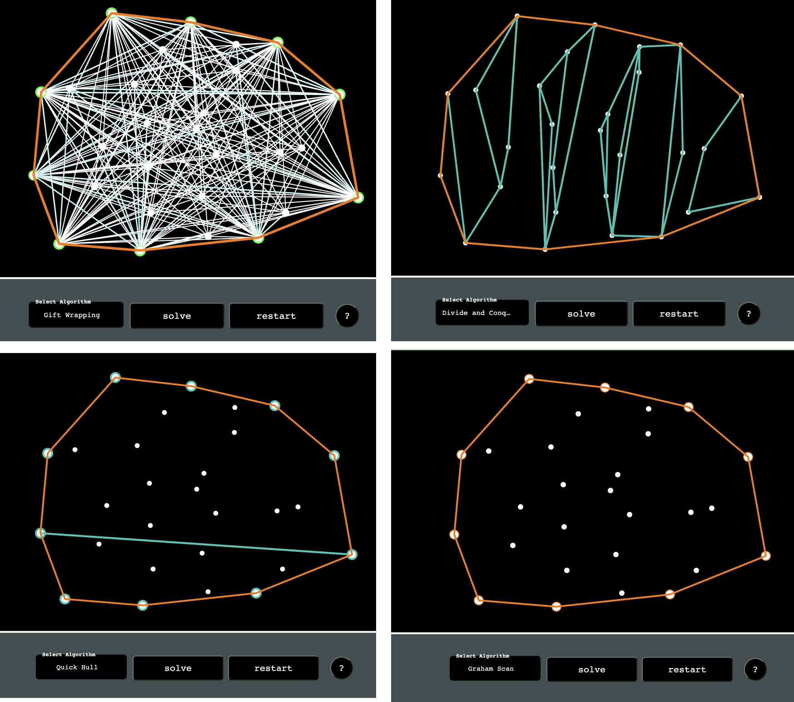

# Convex Hull Visualizer

## Overview

The Convex Hull Visualizer is an interactive web page simulator that visually demonstrates the step-by-step solutions to the Convex Hull problem using four different algorithms: Gift Wrapping, Divide and Conquer, Quick Hull, and Graham Scan. This tool is designed to help users understand the computational geometry concepts behind these algorithms.

You can run the Convex Hull Visualizer locally by following the installation instructions below, or you can access it remotely on [https://yikeli-vivi.github.io/Convex-Hull-Visualiser-/](https://yikeli-vivi.github.io/Convex-Hull-Visualiser-/).

## Features

- Visualization of Convex Hull algorithms in action.
- Four different algorithms to choose from.
- Interactive user interface for adding and removing points.
- Step-by-step execution and visualization.

## Installation

To run the Convex Hull Visualizer locally, you'll need Node.js and npm installed on your machine.

1. Clone this repository to your local machine:

   `git clone https://github.com/YikeLi-Vivi/Convex-Hull-Visualiser-.git`

2. Navigate to the directory 
  `cd Convex-Hull-Visualiser-`

3. Install project dependency 
  `npm install` 

4. Start the development server:
  `npm run dev` 

## Usage
1. Visit the web page either locally or remotely using the provided links.
2. Add points to the canvas by clicking on it.
3. Select one of the Convex Hull algorithms from the dropdown menu.
4. Click the "Start" button to visualize the algorithm step-by-step.
5. Observe the algorithm's progress and the convex hull being formed.
6. Use the "Reset" button to clear the canvas and start over.